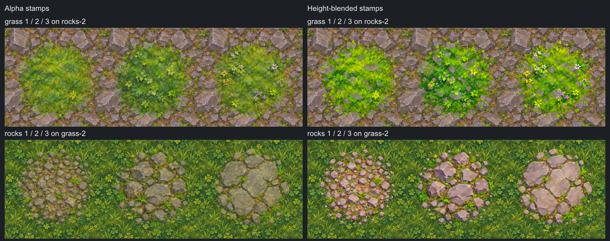

# Making terrain tiles and stamps

We build each terrain material from four matching assets: a repeating color
tile, its height map, a transparent color stamp, and its height map. Tiles cover
the ground. Height blending makes material transitions follow surface features.
Stamps add larger details and break up repetition.

Generate related materials together in a 3x3 sheet. Sharing a generation and
reference image helps keep the palette, scale, and painted style consistent.
The current set contains four grasses, dirt road, cobblestone road, gravel
road, forest floor, and marsh. Earlier sheets used three variations per row;
the dirt, sand, and marsh commands below illustrate that reusable workflow.

Image generation and inpainting use the built-in imagegen tool. All local image
processing uses Nim and Pixie, compiled with `-d:release`. Python is not needed.
See the [terrain tool reference](../tools/terrain/USAGE.md) for all CLI options.

## Asset layout and resolution

Final assets live in the sibling `polyworld_data` repository:

```text
polyworld_data/terrain/
  tiles/
    dirt-1.rgb.png
    dirt-1.height.png
    ...
  stamps/
    dirt-1.rgb.png
    dirt-1.height.png
    ...
```

| Asset | Size | Pixel data |
| --- | --- | --- |
| Tile `.rgb.png` | 256x256 | Opaque color, matching opposite edges |
| Tile `.height.png` | 256x256 | Opaque grayscale, matching opposite edges |
| Stamp `.rgb.png` | 256x256 | Color with original RGBA transparency |
| Stamp `.height.png` | 256x256 | Opaque grayscale, zero outside the footprint |

The `.rgb.png` suffix identifies color. It does not remove a stamp's alpha.
Both kinds of asset use the same base name for color and height.

Keep generation, inpainting, background removal, cropping, and seam repair at
the original high resolution. Our existing sheets are 1254x1254, giving nine
418x418 cells. The cell size must be even for the half-offset operation, and
the sheet must divide exactly into the requested grid.

Only the final export scales cells to 256x256. Do not enlarge a 256x256 export
to make a new working master. A 3x3 preview of final assets is 768x768; sheets
and previews do not need power-of-two dimensions. Individual game assets do.

Keep working files in `polyworld/tmp/terrain-work` and sample renders in
`polyworld/tmp/terrain-samples`. Both are under the Git-ignored `tmp` directory.
Preserve approved high-resolution masters, prompts, and provenance separately
from disposable samples. The existing generation archives are under
`../output/terrain-*-20260908`. Put only final asset pairs in `polyworld_data`.

## Set up a working directory

All commands below run from the `polyworld` repository root. The examples build
a new dirt, sand, and marsh set. Keep these variables in the same shell session:

```sh
terrainWork=tmp/terrain-work/dirt-sand-marsh
terrainData=../polyworld_data/terrain
mkdir -p "$terrainWork/tiles" "$terrainWork/stamps"
nim c -d:release --out:tmp/terrain tools/terrain/terrain.nim
```

The commands reject existing outputs. Use a fresh working directory for a new
attempt, or add `--force` when intentionally rebuilding an output.

## Generate matching stamp and tile sheets

Use a finished terrain image or a previous approved sheet as the style
reference. Keep the same material order and level of detail in both sheets.
Stamps and tiles are different compositions, so generate them as separate
images using the same references. The new stamp sheet can also serve as a
material reference when generating its tile sheet.

For stamps, use a prompt along these lines:

```text
Create a 1254x1254 terrain stamp atlas in the painted fantasy style of the
reference. Exactly 3 equal columns and 3 equal rows, with 418x418 cells.
Row 1: three dirt variations, packed soil, cracked clay, and rooty earth.
Row 2: three sand variations, fine sand, rippled sand, and pebbly sand.
Row 3: three marsh variations, muddy moss, shallow pools, and wet grasses.
Each stamp is roughly circular with an irregular natural boundary, centered
inside its own cell. Leave clear empty margins. No subject may touch another
stamp or cross a cell boundary. Use a perfectly uniform pure black background.
Match the reference palette, texture scale, perspective, and restrained shading.
No labels, grid lines, frames, checkerboard, or cast shadow outside a stamp.
```

Save the result as `$terrainWork/stamps-generated.rgb.png`.

For tiles, use:

```text
Create a 1254x1254 terrain texture atlas matching the reference and stamp sheet.
Exactly 3 equal columns and 3 equal rows, with 418x418 cells. Use the same
dirt, sand, and marsh row order, with three variations per row.
Every cell is a fully covered square ground texture intended to repeat in
both directions. Spread detail across the entire cell, including its edges.
Keep a consistent painted style, material scale, palette, and ground view.
Avoid isolated circular patches, large focal features, directional lighting,
vignettes, borders, labels, grid lines, empty gutters, and transparency.
```

Save this result as `$terrainWork/tiles-generated.rgb.png`. Inspect both images
before processing them. A requested size or seamless texture is not a guarantee
that the generator produced one:

```sh
tmp/terrain inspect "$terrainWork/stamps-generated.rgb.png" 3 3
tmp/terrain inspect "$terrainWork/tiles-generated.rgb.png" 3 3
```

Check the actual dimensions, row order, framing, and scale. Regenerate or fix
the high-resolution layout if cells do not divide evenly, stamps are clipped,
or the generator inserted gutters. Never discard a border blindly if it contains
part of the artwork.

## Remove the stamp background

Our stamps use a flat black matte followed by local background removal:

```sh
tmp/terrain background "$terrainWork/stamps-generated.rgb.png" \
  "$terrainWork/stamps-master.rgb.png" black 10
tmp/terrain inspect "$terrainWork/stamps-master.rgb.png" 3 3
```

The tool removes the matte and estimates edge colors to recover antialiased
transparency. It preserves existing partial alpha. Inspect the result over both
light and dark backgrounds for halos, lost dark details, and unwanted holes.
Use gray or another supported matte only when it is distinguishable from the
artwork. If the image already has correct transparency, keep that alpha.

Each stamp needs clear space around its complete footprint. If the generator
miscentered the subjects, recenter their full pixel bounds at source resolution
before export or height generation. The existing earth set used a dedicated
`align_stamps.nim` script for this. The general cutter does not detect subjects
or recenter them automatically.

Keep this aligned RGBA master. Its alpha will also control height filtering.
Do not apply tile seam repair to a stamp.

## Make diffuse splats from finished tiles

The current nine splats reuse their tiles' exact high-resolution color and
aligned height masters. Generate a separate 3x3 grayscale opacity sheet with
the finished tile sheet as a reference. White means covered, gray means partial
coverage, and black means empty. This is an opacity mask, not a height map.
The [saved generation prompt](terrain-splat-mask.txt) requests broken brush
strokes, irregular lobes, scattered fragments, gaps, and broad fading edges.
Avoid a solid circular outline or a uniform ring around the brush.

At source resolution, convert the mask to alpha with
`smoothstep((gray - 4) / 200)` while preserving the original color channels.
Use a narrow cell-border guard that stays zero through 8 source pixels and
fades to full strength over the next 24 pixels. The generated footprint should
fit inside this guard. Because coverage comes from a separate mask, there is
no black matte to contaminate the retained tile colors.

Keep source height where the brush has coverage. Export each 418x418 cell once
at 256x256 using `resizeTexture(preserveEdges = false)` for color and
`stampHeight` for height filtered through the same alpha. Do not bake alpha into
the opaque height values. The RGB alpha controls coverage for both channels
when blending. Check on light and dark backgrounds and overlap several copies
with different rotations to reveal rims or repeated silhouettes.

The current splats have approximately 23% to 35% integrated coverage per square,
with more than 35,000 partially transparent pixels each. Several placements
build up a continuous area. The local generation archive is
`../output/terrain-soft-splats-20260908`, including full-resolution sources,
masks, exporter, and verification. Final names omit the original `soft-` prefix.

## Make each tile repeat

A half offset wraps each tile independently by half its width and height. This
moves the original edge joins into a cross through the center, where they are
easier to repair. For 418x418 cells, the offset is 209 pixels on each axis.

```sh
tmp/terrain offset "$terrainWork/tiles-generated.rgb.png" \
  "$terrainWork/tiles-offset.rgb.png" 3 3
tmp/terrain mask "$terrainWork/tiles-offset.rgb.png" \
  "$terrainWork/tiles-guide.png" "$terrainWork/tiles-api-mask.png" 3 3
```

Give the offset image and guide to imagegen. The guide is white where editing
is allowed, black where pixels must remain unchanged, and gray for feathering.
The separate API mask uses transparent alpha for editable pixels when an image
API supports a mask input.

```text
Repair the center cross inside each of the nine tiles in the offset atlas.
Use the guide: repair white regions, preserve black regions, and blend through
gray regions. Continue the existing stones, cracks, grasses, and soil naturally.
Keep the exact input dimensions, cell boundaries, palette, scale, and material
order. Preserve the corner content and avoid introducing recognizable motifs.
Do not add borders, gutters, text, or new lighting. Return the repaired color
atlas only, without the guide drawn into it.
```

Save the returned image as `$terrainWork/tiles-repaired.rgb.png`, then compose
only its masked regions back onto the source:

```sh
tmp/terrain blend "$terrainWork/tiles-offset.rgb.png" \
  "$terrainWork/tiles-repaired.rgb.png" "$terrainWork/tiles-guide.png" \
  "$terrainWork/tiles-blended.rgb.png"
tmp/terrain tile "$terrainWork/tiles-blended.rgb.png" \
  "$terrainWork/tiles-master.rgb.png" 3 3 24
```

Source, repair, and guide must have identical dimensions. `blend` preserves
pixels outside the guide exactly, even if imagegen changed those pixels.
`tile` then adjusts a narrow edge band and makes opposite boundary pixels equal.
This last correction can change pixels outside the inpainting guide.

The repaired, offset orientation becomes the finished color master. Generate
height from this master so both maps share the same coordinates. Do not offset
only one of a color/height pair later.

Each tile repeats with itself. Different variants are not guaranteed to meet
seamlessly when placed side by side. Blend material weights and use stamps to
hide that change and reduce recognizable repetition.

## Generate height from the finished color masters

Generate separate height sheets for the finished tile master and aligned stamp
master. Height should describe relief above the ground plane. White is higher,
black is lower. It is an inferred blend mask, not measured geometry, a camera
depth map, or a normal map.

Use the original color master as the edit target. An approved height sheet can
provide a shared value-range reference, but must not replace the target shapes.

```text
Convert this exact color atlas into an aligned grayscale surface height map.
Preserve every feature's position, shape, scale, orientation, and cell layout.
Keep the exact image dimensions. Infer relief, ignoring color and lighting.
Stone tops and leaf tips are higher. Cracks, gaps, and recessed soil are lower.
Water is flat and low. Sand has shallow relief. Do not paint cast shadows or
directional highlights into the map. Use consistent height ranges across all
materials, without contrast-stretching each cell independently.
Do not add, move, rotate, or redesign features. No labels or grid lines.
```

For stamps, also request an opaque black background outside the original
footprint, and no circular dome or radial height gradient across the whole patch.
Save the two results as `$terrainWork/tiles-generated.height.png` and
`$terrainWork/stamps-generated.height.png`.

Compare each height image with its color source, especially stone boundaries,
large leaves, cracks, and pool outlines. Fine foliage may be reinterpreted by
the generator. Regenerate significant misalignments before export.

### Tile height processing

```sh
tmp/terrain height "$terrainWork/tiles-generated.height.png" \
  "$terrainWork/tiles-master.height.png" 3 3 8
```

This converts the generated image to opaque grayscale and repairs its edge band
at source resolution. It does not infer height from color. Export it with the
same grid and final dimensions as the color master.

### Stamp height processing

```sh
tmp/terrain stamp-height "$terrainWork/stamps-generated.height.png" \
  "$terrainWork/stamps-master.rgb.png" \
  "$terrainWork/stamps-256.height.png" 3 3
```

This is a final export operation: it filters each source cell to 256x256 using
the original stamp alpha, then stores opaque grayscale height. Outside the final
footprint, height is zero. Weighting the filter by alpha prevents the black
background from lowering heights along transparent edges.

There is no half offset, seam repair, or independent normalization for stamps.
The output sheet is already 768x768. Cutting it into 256x256 cells does not
resample it again. The stamp color master remains at its source resolution until
its own final export.

## Cut, name, and validate the final assets

`cut` defaults to the original grass/rocks/path names for a 3x3 sheet. Use
`--channel height` for height files. For a different material set, export each
row with an explicit material prefix so that dirt is not accidentally named
grass.

This helper exports the dirt/sand/marsh rows. Its fourth argument is the current
cell size, which is 418 for our high-resolution masters and 256 for the already
exported stamp-height sheet:

```sh
exportTerrainRows() {
  terrainAtlas="$1"
  terrainDirectory="$2"
  terrainChannel="$3"
  terrainCell="$4"
  terrainY=0
  for terrainMaterial in dirt sand marsh; do
    terrainRowFile="$terrainDirectory/$terrainMaterial-$terrainChannel.row.png"
    tmp/terrain crop "$terrainAtlas" "$terrainRowFile" \
      0 "$terrainY" "$((terrainCell * 3))" "$terrainCell"
    tmp/terrain cut "$terrainRowFile" "$terrainDirectory" \
      3 1 "$terrainMaterial" --channel "$terrainChannel"
    terrainY=$((terrainY + terrainCell))
  done
}

exportTerrainRows "$terrainWork/tiles-master.rgb.png" \
  "$terrainWork/tiles" rgb 418
exportTerrainRows "$terrainWork/tiles-master.height.png" \
  "$terrainWork/tiles" height 418
exportTerrainRows "$terrainWork/stamps-master.rgb.png" \
  "$terrainWork/stamps" rgb 418
exportTerrainRows "$terrainWork/stamps-256.height.png" \
  "$terrainWork/stamps" height 256
```

Adjust the row names and source cell size for a different sheet. `cut` filters
cells independently, so adjacent materials cannot bleed into each other. Color
and tile-height exports default to 256x256, preserving matching tile boundaries.

```sh
for terrainImage in "$terrainWork"/tiles/*.rgb.png \
  "$terrainWork"/tiles/*.height.png; do
  tmp/terrain check "$terrainImage"
done
for terrainImage in "$terrainWork"/stamps/*.rgb.png \
  "$terrainWork"/stamps/*.height.png; do
  tmp/terrain inspect "$terrainImage"
done
tmp/terrain repeat "$terrainWork/tiles/dirt-1.rgb.png" \
  "$terrainWork/dirt-1-repeat.png" 3 3
```

`check` requires 256x256, full opacity, and exact opposite-edge equality. Use
`inspect` for stamps because transparency and unmatched edges are allowed.
Also inspect repeats visually: equal boundary pixels alone do not guarantee
convincing shape continuation or inconspicuous repetition.

Before publishing, verify that every color has its matching height, all files
are 256x256, height is grayscale, stamp color retains antialiased alpha, and
height is zero outside the stamp footprint. The existing set exporters perform
these checks, source-color comparisons, and exact PNG round-trip verification.

Copy only the approved pairs to the data repository. The row crops, masks,
masters, and preview images stay in the working directory:

```sh
mkdir -p "$terrainData/tiles" "$terrainData/stamps"
cp -i "$terrainWork"/tiles/*.rgb.png "$terrainWork"/tiles/*.height.png \
  "$terrainData/tiles/"
cp -i "$terrainWork"/stamps/*.rgb.png "$terrainWork"/stamps/*.height.png \
  "$terrainData/stamps/"
```

## Blend tiles and stamps into terrain

For tiles, sample color and height using the same UVs. Treat height as linear
data from the red channel. `heightAmount` in
[`heights.nim`](../tools/terrain/heights.nim) adjusts a two-material paint weight
using both heights. The defaults are strength 1.2 and transition depth 0.12.
Smaller depth makes the transition sharper. Pure paint endpoints stay pure.

For stamps, keep alpha and height separate. Alpha bounds the footprint. Height
decides which surface details survive the blend. This gives clearer individual
stones and leaves than ordinary translucent color overlap:



[`stamps.nim`](../tools/terrain/stamps.nim) keeps a color canvas and a
floating-point height buffer. Attach the original color alpha to the height map
with `stampStencil`, transform both images identically, then call
`compositeStamp`. It updates color and height together so later stamps see the
already painted surface. Transparent pixels and zero paint leave it unchanged.

A complete terrain bake first covers the surface with tile materials, then
blends their boundaries, and finally applies stamps with varied position, size,
rotation, and paint amount. Keep terrain masks controlling the path and material
coverage so details do not obscure the intended layout.

## Preview and test

```sh
nim r -d:release --out:tmp/gen_blends tools/terrain/gen_blends.nim
nim r -d:release --out:tmp/gen_stamp_blends tools/terrain/gen_stamp_blends.nim
nim r -d:release --out:tmp/gen_terrain_sample tools/terrain/gen_sample.nim
```

The generators write under `tmp/terrain-samples`:

| Directory | Purpose |
| --- | --- |
| `height-blend` | Ordinary and height-based tile transitions |
| `stamp-blends` | Alpha and height blending for all nine current stamps |
| `path-64-stamp-height` | A 64x64-cell layout baked at 1024x1024 |

The sample bake compares the same 2363 stamp placements with both blend modes.
Its ground uses identical linear material weights in both versions to isolate
the stamp-blending effect. It saves color, accumulated height, and a recipe with
the seed and placements. The larger sample images are previews, not replacements
for the 256x256 material assets. Never save sample renders in `polyworld_data`.

```sh
nim check tools/terrain/terrain.nim
nim check tests/test_terrains.nim
nim r --out:tmp/test_terrains tests/test_terrains.nim
```

The terrain tests cover cuts, alpha round trips, matte removal, seam repair,
power-of-two export, height preparation, transparent-edge filtering, and
accumulated stamp heights. They are also included in `tests/tests.nim`.

## Interactive AI terrain experiment

[`quadterrain_aigen.nim`](../experiments/terrain/quadterrain_aigen.nim) is a
terrain experiment that loads the nine soft terrain paintings directly at
256x256. Its grass, fir trees, and rendering settings follow
`quadterrain_shadows.nim`, with textured Meadow boulders.
Run it from the `polyworld` repository:

```sh
nim r -d:release --out:tmp/quadterrain_aigen \
  experiments/terrain/quadterrain_aigen.nim
```

It uses four grass paintings, dirt road, cobblestone road, gravel road, forest
floor, and marsh, all with matching height maps. The files are named
`grass-1.rgb.png`, `grass-1.height.png`, and so on. Map generation assigns one
grass material ID per tile using broad, seeded simplex-noise regions. Smoothed local
height and slope favor mossy grass in low ground, olive grass in dry uplands,
and sparse grass on exposed slopes. The green painting fills the remaining
meadow areas. Circular falloffs blend nearby tile centers, and splats inherit
their source tile's painting. This keeps clumps consistent while blending
their boundaries. Color and height mipmaps are built independently,
then tile height is packed into alpha.
Splats load the matching stamp color and height pairs by the same names. They
retain separate color and height arrays, filtered with the same alpha coverage
so their transparent edges do not acquire dark halos.

The road leaves the fort gate straight and then follows broad bends. Shared
curve functions in `aigen_surfaces.nim` control the ground flattening, material
mask, and tree clearance. The shader paints the road continuously across tile
boundaries and uses the same height blend controls for its grassy edges.

Open the **Textures** tab in the control panel:

- **Splats** shows or hides the generated stamps.
- **Height-based blending** switches both tiles and stamps between height
  blending and ordinary color blending.
- **Texture size** changes the world size of every tile repeat and stamp
  together. All generated images remain 256x256 and have the same texel density.
- **Grass patch size** changes the scale of the grass regions, from 8 to 48
  world tiles, defaulting to 24. It changes material placement independently
  of the shared texture resolution and repeat size.
- **Splat placement** controls the probability of placing a brush on a terrain
  tile. It defaults to 40%.
  A tile can also receive overlapping brushes from neighboring tiles.
- **Splat amount** changes the paint amount independently of placement. Its
  default is 1.00. Zero makes the stamps contribute nothing.
- **Height blend** and **Blend depth** control relief strength and transition
  softness. They default to 1.30 and 0.43, respectively.

The base blend uses `aigen_blends.nim`. Each tile uploads the four surrounding
material IDs for each of its corners, excluding tiles at a different corner
height. The shader samples this neighborhood and evaluates circular falloffs
around tile centers per pixel, independently of mesh triangle interpolation.
Identical material IDs combine before height blending. Height influence fades
out with small coverage, so a tall detail cannot win where its material is
almost absent. A material keeps full coverage at its own tile center, and its
influence reaches zero one tile away.
There is no square center mask or priority that forces rocks onto shared edges.

The **Color blend view** checkbox below the panel tabs toggles the colored
blend weights on and restores painted textures when off. It is available
from every tab. For more detail, use **Textures > Terrain view**:

1. **Material IDs** shows the assigned tile materials as solid colors.
2. **Blend weights** shows their rounded coverage before height affects it.
3. **Height weights** shows coverage after the height blend.
4. **Painted** restores the textures, curved road paint, and splats.

Gravel is pink in these diagnostic views. Grass uses green, teal, gold, and
brown. The weight views omit road paint and splats to isolate the base terrain
blend. Disable **Splats** and **Height-based blending** independently to compare
the painted result, and use **Layers > Show edges** to overlay the actual grid.
For scripted captures, `BLEND_VIEW` accepts `painted`, `materials`, `weights`,
or `height`.

[`aigen_splats.nim`](../experiments/terrain/aigen_splats.nim) stores a variable
span of splats per tile in a flat array. There is no fixed number of shader
slots. Placement is seeded and varies the brush, position, and rotation across
the full 0 to 360 degree range. Color and height use the same rotated coordinates.
Brush size follows the shared texture slider. Brushes follow connected tiles with
matching edge heights, including beyond immediate neighbors at larger scales,
and preserve their compositing order across boundaries. Water and disconnected
heights do not receive those overlaps. Each stamp updates both color and the
accumulated height before the next stamp is blended.

Rendering cost increases with the number of brushes overlapping visible tiles.
Splats share the terrain draw call, but each overlapping brush adds shader work
and color and height texture samples inside its footprint. Reducing placement or
brush size reduces that work; lowering paint amount alone keeps the same brushes.

For repeatable comparisons, set `SPLATS=0` or `HEIGHT_BLEND=0` before launching.
`SPLAT_PLACEMENT` and `SPLAT_AMOUNT` accept zero to one. `TEXTURE_SIZE` accepts
0.5 to 12 world tiles. `GRASS_PATCH_SIZE` accepts 8 to 48 world tiles and uses
the terrain seed for repeatable grass regions. `SPLATS_PER_TILE` sets the
number of placement attempts per tile, defaulting to one; each attempt uses
the placement probability. The placement budget and GPU buffer capacity still
apply.

The forest uses only the dense `tree_fir_01` and `tree_fir_02` models and their
fir texture from `quadterrain_shadows.nim`. The tall sparse fir, bare snag,
broadleaf trees, and extra per-tree bushes are omitted. Tree tiles still block
movement and sight.

Grass puffs use the shadows experiment's `low_poly_grass.glb`, with palette
colors baked into their vertices. Boulders use `rock_large_02a` and
`rock_medium_01a` from Meadow's `rocks.glb`, preserving their UVs and
`terrain_stone_02d.png` texture. Trees and boulders share the textured geometry
renderer with separate native 1024x1024 texture layers. Fir cards retain
alpha-tested edges, while the rock texture is opaque.

The default camera, lighting, lack of MSAA, and 2048x2048 shadow map match the
shadows experiment. The previous art-pass setup requested 8x MSAA, a 4096x4096 shadow
map, and 2048x2048 painted prop atlases; polygon count alone does not capture
those rendering costs. The generated terrain textures, variation, height
blending, and optional splats remain the terrain-specific additions.

```sh
nim check experiments/terrain/quadterrain_aigen.nim
nim check tests/test_aigen_blends.nim
nim check tests/test_aigen_splats.nim
nim r --out:tmp/test_aigen_blends tests/test_aigen_blends.nim
nim r --out:tmp/test_aigen_splats tests/test_aigen_splats.nim
```

The shared `src/polyworld/quadterrain.nim` runtime still expects 1024x1024
materials. The experiment owns its renderer and uses the new 256x256 assets
independently.
