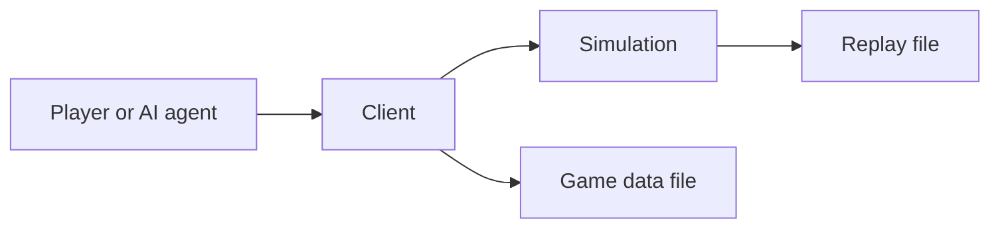

# PolyWorld design

Status: Draft

## Summary

PolyWorld is a low-poly 3D game engine for AI research and rapidly built
games. It extends the Bitworld model with a 3D client, a layered tile world,
and unified art library.

Every game runs as a deterministic, authoritative simulation. The simulation
owns all gameplay state and rules. The client renders that state and sends
player commands.

Art is separate from the simulation. It may describe how something looks or
sounds, but never what it means to the simulation. Each game ships its own
data file.

## Art library

Examples, experiments, and tools load models, textures, fonts, and UI from
`polyworld_data`. Clone it next to this folder. Each game ships the files it
needs as its own data file.

```
git clone git@github.com:Metta-AI/polyworld-data.git ../polyworld_data
```

The two folders should sit like this:

```
polyworld/
polyworld_data/
```

Games load files from `../polyworld_data/` when run from this repo root.

## Commands

Run these from the polyworld repo root after `polyworld_data` is cloned next
to it.

### Games

Each game takes the same flags. `--bot` starts a live match with BASIC
scripts. `-d:headless --record` runs without a window and writes a replay.
`--replay` plays that file back. `-d:emscripten` builds the wasm client.

```
# Gods of the Arena
nim r examples/gods_of_the_arena/gota.nim --bot examples/gods_of_the_arena/players/base.bas:10
nim r -d:headless examples/gods_of_the_arena/gota.nim --seed 1988 --bot examples/gods_of_the_arena/players/base.bas:10 --record examples/gods_of_the_arena/replays/demo.replay
nim r examples/gods_of_the_arena/gota.nim --replay examples/gods_of_the_arena/replays/demo.replay
nim c -d:emscripten examples/gods_of_the_arena/gota.nim

# Light vs. Dark
nim r examples/light_vs_dark/lvd.nim --bot examples/light_vs_dark/players/base.bas:2
nim r -d:headless examples/light_vs_dark/lvd.nim --seed 1988 --bot examples/light_vs_dark/players/base.bas:2 --record examples/light_vs_dark/replays/demo.replay
nim r examples/light_vs_dark/lvd.nim --replay examples/light_vs_dark/replays/demo.replay
nim c -d:emscripten examples/light_vs_dark/lvd.nim

# Call to Adventure
nim r examples/call_to_adventure/cta.nim --bot examples/call_to_adventure/players/base.bas:4
nim r -d:headless examples/call_to_adventure/cta.nim --seed 1988 --bot examples/call_to_adventure/players/base.bas:4 --record examples/call_to_adventure/replays/demo.replay
nim r examples/call_to_adventure/cta.nim --replay examples/call_to_adventure/replays/demo.replay
nim c -d:emscripten examples/call_to_adventure/cta.nim
```

The `:N` after a bot path is how many copies to load. Gods of the Arena
needs 10, Light vs Dark needs 2, Call to Adventure needs 4.

### Experiments

Experiments are stand-alone windows for trying one engine piece without
starting a full game. Terrain labs the heightfield, blending, shadows, and
path smoothing. Character labs load a skinned glb or the modular outfit
viewer. Particles and fxmesh are GPU effect editors with json presets.

```
# Terrain
nim r experiments/terrain/quadterrain.nim
nim r experiments/terrain/quadterrain_blended.nim
nim r experiments/terrain/quadterrain_shadows.nim
nim r experiments/terrain/quadterrain_pathing.nim

# Characters
nim r experiments/characters/characters.nim
nim r experiments/modular_chars/modular_chars.nim

# Effects
nim r experiments/particles/particles.nim
nim r experiments/fxmesh/fxmesh.nim
```

## Goals

- Make simulations deterministic, reproducible, and easy to inspect.
- Produce a replay for every session that can reproduce the complete game.
- Support a 3D client that can run in a browser.
- Make layered, grid-based worlds straightforward to generate and navigate.
- Provide a reusable art library of low-poly models, meshes, textures, sounds,
  icons, and particle effects.
- Include the common UI, world overlay, audio, and particle primitives needed
  by games.
- Support headless execution for AI training, evaluation, and debugging.
- Keep the engine simple enough for people and coding agents to extend safely.
- Support two modes of interaction:
- Playing the game
- Spectating a live game or a replay

## Non-goals

- PolyWorld is not a general-purpose scene graph or rendering engine.
- The simulation does not include art.
- A game's data file does not define collision, movement, health, damage, range,
  or any other gameplay property.
- The client is not trusted to make authoritative gameplay decisions.
- Will never require client-side simulation or prediction.

## Design principles

### The simulation is authoritative

The simulation owns the world, accepts commands, advances ticks, and
publishes results. Clients may interpolate or animate visual state, but those
changes have no gameplay effect.

### Simulation and presentation stay separate

Simulation data answers questions such as whether a tile can be crossed, how
large an entity is, and how much health it has. Presentation data answers
questions such as which mesh to draw, which sound to play, and which particle
effect to emit.

The simulation may name art in the game's data file. It must never read that
file to decide simulation behavior. Missing art may make a client look
incomplete, but it must not change the result of a simulation.

### Determinism is a feature, not a debugging mode

Given the same engine version, initial state, configuration that includes a random seed, and
ordered commands, the simulation must produce the same state at every tick.

### The tile grid is the shared spatial model

Gameplay positions, movement, collision, occupancy, and pathfinding use
integer tile coordinates. Rendering may use floating-point coordinates, but
rendering values cannot flow back into the simulation.

## System overview



The system has three main parts:

- The simulation owns rules and state, advances ticks, validates
  commands, and writes replays.
- The client renders simulation state, collects input, and presents UI, audio,
  and effects.
- Each game ships a data file the client draws and plays from.

Games use a shared client library for rendering, map display, UI,
world overlays, sound, and particles. Each game supplies its own simulation,
map generation, rules, presentation, and data file.

## Deterministic simulation

### Tick model

The simulation advances on a fixed tick. Each tick runs the same phases in a fixed
order:

1. Read commands assigned to the tick.
2. Validate and normalize those commands.
3. Update entities and game systems.
4. Resolve collisions, interactions, and removals.
5. Emit presentation events and client-visible state.
6. Compute an optional state hash for verification.
7. Append accepted commands and verification data to the replay.

The exact tick rate is game configuration. It is recorded in the replay and
cannot change during a session.

However, it can be run at any tick rate, including as fast as possible, but by default it has a known tick rate of 24 frames per second. But any game can decide to set the tick rate higher or lower. Also, when they process a tick, they can send a little command, such as "ready for next tick." If all the AIs send "ready for next tick," it can advance much further. Human viewers watching a replay can pause, resume, or speed up the simulation.

### Determinism rules

- Simulation state uses integers, fixed-point values, enums, and flat data.
- Simulation code does not depend on wall-clock time.
- Randomness comes from an explicit seeded generator owned by the simulation.
- Entity and system iteration orders are stable and defined.
- Commands are assigned a tick and a deterministic order before execution.
- Rendering, audio, and particle systems do not modify simulation state.
- State hashes use a canonical serialization order.

### Commands and state

The game receives intentions such as moving, interacting, or using an ability. A
command includes the session, actor, target tick, sequence number, command
kind, and command-specific data. The simulation verifies ownership, timing,
preconditions, and bounds before accepting it.

An individual Poly World game might extend the command set, but there are a
lot of common commands to choose from. There is a basic theme to the
commands, but any Poly World game eventually chooses which subset it supports.

The client starts from an initial snapshot followed by tick-stamped
state updates and presentation events. Prediction may be added later, but the
simulation state remains authoritative.

### Replay format

A replay contains enough information to reconstruct a session:

- Replay format version.
- Engine and game versions.
- Game configuration and tick rate.
- Initial state or the inputs and generator version used to create it.
- All random seeds.
- Every accepted command with its tick and deterministic order.
- Periodic state hashes for divergence detection.
- Optional checkpoints for faster seeking.

Replay simulation must not require the game's data file. Visual playback
may use placeholder art when a referenced file is unavailable.

## World model

### Coordinates and bounds

A world contains a finite set of grid layers. Each layer has an integer origin,
width, height, and layer identifier. Layers may have different bounds, so a
coordinate valid on one layer may not exist on another.

A tile position is the tuple `(layer, x, y)`. World limits and numeric widths
must be explicit so malformed maps and commands can be rejected
before allocation or simulation.

### Layers and cells

A layer stores a flat row-major array of cells. A cell contains the minimum
simulation data needed by the game, such as terrain kind, traversal flags,
movement cost, occupancy, and links to other layers. Presentation identifiers
for terrain or decoration are stored separately or treated only as labels.

Generators produce the same map for the same generator version, configuration,
and seed. Imported maps are normalized to the same world interface.

### Navigation interface

Pathfinding must operate on the world model without understanding rendering or
generator internals. The map interface provides explicit operations to:

- Test whether a position exists.
- Read traversal flags and movement cost.
- Enumerate neighbors in a stable order.
- Query occupancy for a given entity footprint.
- Follow explicit links between layers.

JPS+ and A* are the default pathfinding algorithm. Games may supply a movement profile
that selects allowed terrain, footprint, cost rules, and layer links. Diagonal
movement is disabled unless a game enables and defines its corner rules.

The simulation is largely responsible for pathfinding. Clients can request
paths into other places.

### Entities

Simulation entities use stable integer identifiers. Their core spatial state
contains a tile position, footprint, and facing when relevant. Health, hard
points, collision, speed, range, and similar properties live only in game
simulation data.

An entity may reference a presentation descriptor containing a model, material,
animation set, icon, sounds, and effects. Changing that descriptor cannot
change the entity's footprint or behavior.

## Game data files

### Art boundary

A game's data file may contain:

- Low-poly models and meshes.
- Textures and materials.
- Images and icons.
- Sound effects and loops.
- Text-based particle effect definitions.
- Presentation-only animation and attachment data.

It must not contain authoritative collision shapes, health, damage, movement
costs, hard points, weapon ranges, resource values, or other simulation data.
Even if a file includes useful dimensions or bounds, the simulation must use its
own explicit simulation values.

### Shipping and loading

Each game ships its own data file. The client loads that file from disk or
from the wasm pack and looks up art by path inside it.

If a file is not found, it is rendered as a simple cube or sphere. If it is
found, it is loaded. The files carry the animations the simulation names,
which animation should be played when.

Missing or invalid art produces a visible placeholder and a descriptive
client error. It never stops the simulation and never substitutes gameplay
data.

## Client presentation

### Rendering

The client maps simulation tile positions to the 3D scene and interpolates between
authoritative updates for smooth motion. Camera state, interpolation, visual
scale, and animation time are client-only values.

The renderer needs primitives for tiled terrain, entities, decorations,
lighting, cameras, animations, and art placeholders. The initial visual style
targets readable low-poly scenes rather than photorealism.

### Screen-space UI

The UI system provides a small, consistent set of controls:

- Anchored and absolute positioning.
- Buttons and input regions.
- Text and icons.
- Panels, progress indicators, and simple lists.
- Pointer, keyboard, and touch input.

Game UI consumes client-visible state and sends commands. It does not mutate
the local simulation state directly.

### World-space overlays

Overlays attach presentation elements to an entity or tile. Built-in overlay
types include health bars, names, chat bubbles, interaction prompts, and status
markers. The client resolves projection, screen bounds, overlap, visibility,
and distance limits.

### Audio

The audio system supports one-shot effects, positional effects, music, ambient
loops, and entity-attached loops. The simulation may request a sound by path
in the game's data file. Volume, panning, device selection, and accessibility
settings remain local to the client.

### Particles

Particle effects are json-based art. A definition describes
emitters, spawn timing, lifetime, motion, color, scale, and referenced textures
or meshes. A small editor previews and validates the same format used at
runtime.

Particle effects are presentation-only. Definitions have hard limits for
particle count, lifetime, spawn rate, and referenced file size.

## AI research interface

The simulation can run without a renderer. A headless
runner provides:

- Deterministic reset from a scenario and seed.
- A structured observation for each controlled agent.
- The same command interface used by human players.
- Single-tick stepping and accelerated execution.
- Replay recording and state hashing.

Observation and action schemas are game-specific and versioned. They expose
simulation state directly and do not require image recognition unless an
experiment explicitly chooses rendered observations.

## Validation and testing

The engine is ready for a release when the following checks pass:

- Two runs with the same inputs produce identical state hashes at every tick.
- A replay reproduces the final state of its recorded session.
- Different client frame rates do not change simulation results.
- Art failure tests confirm that missing or corrupt files do not affect the
  simulation.
- Generated maps are bounded, valid, and produce stable navigation results.
- Pathfinding tests cover blocked cells, footprints, layer links, and ties.
- Headless simulations produce the same result as simulations with a client.
- Long-running sessions keep command queues, histories, and caches bounded.

Every deterministic test should print the seed, configuration, and first
divergent tick when it fails.

## Delivery plan

### 1. Deterministic core

Implement the fixed tick pipeline, commands, seeded randomness, canonical state
hashing, replay recording, and headless replay verification.

### 2. World and navigation

Implement bounded layers, cells, generators, occupancy, inter-layer links, and
A* pathfinding through the shared map interface.

### 3. Browser client

Implement a minimal low-poly renderer for a single game.

### 4. Game data files

Each game ships its own data file. Load it locally, show placeholders when
art is missing, and never let missing art change the simulation.

### 5. Presentation systems

Add screen-space UI, world overlays, audio, particles, and the text-based
particle editor.

### 6. AI tooling

Add structured observations, actions, accelerated stepping, experiment fault
controls, and batch replay verification.
