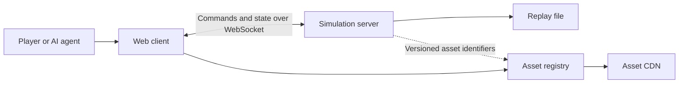

# PolyWorld design

Status: Draft

## Summary

PolyWorld is a low-poly 3D game engine for AI research and rapidly built
online games. It extends the Bitworld model with a browser-based 3D client,
a layered tile world, and a shared library of visual, ui and audio assets.

Every game runs as a deterministic, authoritative simulation. Players connect
to a WebSocket server through a web client. The server owns all gameplay state
and rules, while clients render that state and send player commands.

Reusable assets are hosted separately from the game server. Shared assets may
describe how something looks or sounds, but never what it means to the
simulation. This boundary allows assets to improve without silently changing
gameplay.

## Goals

- Make simulations deterministic, reproducible, and easy to inspect.
- Produce a replay for every session that can reproduce the complete game.
- Support browser clients and independently hosted WebSocket servers.
- Make layered, grid-based worlds straightforward to generate and navigate.
- Provide a reusable library of low-poly models, meshes, textures, sounds,
  icons, and particle effects.
- Include the common UI, world overlay, audio, and particle primitives needed
  by games.
- Support headless execution for AI training, evaluation, and debugging.
- Keep the engine simple enough for people and coding agents to extend safely.
- Support various other points, such as /healthz or /scores and stuff.
- To support two modes of interaction with it:
- Connecting as a player and being able to play the game
- Connecting as a spectator and being able to spectate a live game or a replay.

## Non-goals

- PolyWorld is not a general-purpose scene graph or rendering engine.
- The simulation server does not host game assets.
- Shared assets do not define collision, movement, health, damage, range, or
  any other gameplay property.
- Clients are not trusted to make authoritative gameplay decisions.
- Will never require client-side simulation or prediction.

## Design principles

### The server is authoritative

The server owns the world, accepts commands, advances the simulation, and
publishes results. Clients may interpolate or animate visual state, but those
changes have no gameplay effect.

### Simulation and presentation stay separate

Simulation data answers questions such as whether a tile can be crossed, how
large an entity is, and how much health it has. Presentation data answers
questions such as which mesh to draw, which sound to play, and which particle
effect to emit.

The server may refer to presentation assets by identifier. It must never read
an asset to decide simulation behavior. A missing asset may make a client look
incomplete, but it must not change the result of a simulation.

### Determinism is a feature, not a debugging mode

Given the same engine version, initial state, configuration that includes a random seed, and
ordered commands, the server must produce the same state at every tick.

### The tile grid is the shared spatial model

Gameplay positions, movement, collision, occupancy, and pathfinding use
integer tile coordinates. Rendering may use floating-point coordinates, but
rendering values cannot flow back into the simulation.

## System overview

The system has four main deployable parts:

- The simulation server owns rules and state, advances ticks, validates
  commands, and writes replays.
- The web client renders server state, collects input, and presents UI, audio,
  and effects.
- The asset registry resolves stable asset identifiers to immutable versions
  and metadata.
- The asset CDN stores and serves files referenced by the registry.

Games use a shared client library for networking, rendering, map display, UI,
world overlays, sound, and particles. Each game supplies its own simulation,
map generation, rules, and presentation manifest.

## Deterministic simulation

### Tick model

The server advances on a fixed tick. Each tick runs the same phases in a fixed
order:

1. Read commands assigned to the tick.
2. Validate and normalize those commands.
3. Update entities and game systems.
4. Resolve collisions, interactions, and removals.
5. Emit presentation events and client-visible state.
6. Compute an optional state hash for verification.
7. Append accepted commands and verification data to the replay.

The exact tick rate is game configuration. It is recorded in the replay and
cannot change during a session.

However, it can be run at any tick rate, including as fast as possible, but by default it has a known tick rate of 24 frames per second.But any game can decide to set the tick rate higher or lower. Also, when they process a tick, they can send a little command, such as "ready for next tick." If all the connected AIs send "ready for next tick," it can advance much further. Humans, human connections, and human clients, such as viewers, can also change the tick rate, such as spectators when they are watching a replay. They can pause, resume, or speed up the simulation. When humans connect, they can also set their tick rate.

### Determinism rules

- Simulation state uses integers, fixed-point values, enums, and flat data.
- Simulation code does not depend on wall-clock time.
- Randomness comes from an explicit seeded generator owned by the simulation.
- Entity and system iteration orders are stable and defined.
- Commands are assigned a tick and a deterministic order before execution.
- Network arrival order is never used as an implicit gameplay rule.
- Rendering, audio, and particle systems do not modify simulation state.
- State hashes use a canonical serialization order.

### Commands and state

Clients send intentions such as moving, interacting, or using an ability. A
command includes the session, actor, target tick, sequence number, command
kind, and command-specific data. The server verifies ownership, timing,
preconditions, and bounds before accepting it.

An individual Poly World game might extend the protocol between the client and the server, but there are a lot of common protocols to choose from. There is a basic theme to the protocol, but any Poly World game eventually chooses which subset it supports.

The baseline client receives an initial snapshot followed by tick-stamped
state updates and presentation events. Prediction may be added later, but the
server state remains authoritative.

### Replay format

A replay contains enough information to reconstruct a session without the
original clients:

- Replay format version.
- Engine and game protocol versions.
- Game configuration and tick rate.
- Initial state or the inputs and generator version used to create it.
- All random seeds.
- Every accepted command with its tick and deterministic order.
- Asset manifest version for faithful visual playback.
- Periodic state hashes for divergence detection.
- Optional checkpoints for faster seeking.

Replay simulation must not require the asset registry or CDN. Visual playback
may use placeholder assets when a referenced version is unavailable.

## World model

### Coordinates and bounds

A world contains a finite set of grid layers. Each layer has an integer origin,
width, height, and layer identifier. Layers may have different bounds, so a
coordinate valid on one layer may not exist on another.

A tile position is the tuple `(layer, x, y)`. World limits and numeric widths
must be explicit in the protocol so malformed maps and commands can be rejected
before allocation or simulation.

### Layers and cells

A layer stores a flat row-major array of cells. A cell contains the minimum
simulation data needed by the game, such as terrain kind, traversal flags,
movement cost, occupancy, and links to other layers. Presentation identifiers
for terrain or decoration are stored separately or treated only as labels.

Generators produce the same map for the same generator version, configuration,
and seed. Imported maps are normalized to the same world interface.

### Navigation interface

Pathfinding must operate on the world model without understanding rendering or
generator internals. The map interface provides explicit operations to:

- Test whether a position exists.
- Read traversal flags and movement cost.
- Enumerate neighbors in a stable order.
- Query occupancy for a given entity footprint.
- Follow explicit links between layers.

JPS+ and A* are the default pathfinding algorithm. Games may supply a movement profile
that selects allowed terrain, footprint, cost rules, and layer links. Diagonal
movement is disabled unless a game enables and defines its corner rules.

Server is largely responsible for most of the pipe finding clients can call in different paths into other stuff.

### Entities

Simulation entities use stable integer identifiers. Their core spatial state
contains a tile position, footprint, and facing when relevant. Health, hard
points, collision, speed, range, and similar properties live only in game
simulation data.

An entity may reference a presentation descriptor containing a model, material,
animation set, icon, sounds, and effects. Changing that descriptor cannot
change the entity's footprint or behavior.

## Asset system

### Asset boundary

The shared asset library may contain:

- Low-poly models and meshes.
- Textures and materials.
- Images and icons.
- Sound effects and loops.
- Text-based particle effect definitions.
- Presentation-only animation and attachment data.

It must not contain authoritative collision shapes, health, damage, movement
costs, hard points, weapon ranges, resource values, or other simulation data.
Even if an asset includes useful dimensions or bounds, the server must use its
own explicit simulation values.

### Identity and versioning

The server identifies their name by their path in the asset registry, but the server knows that the assets can be updated at any time, so everything is at the best effort serving here. If the asset isn't found, it is just rendered as a simple cube or sphere. If the asset is found, it is loaded as well. The assets carry the animations the server supplies, which animation should be played when.

There is no special identifier to version the assets. Many politics-based games can share their assets. Assets can be periodically updated or improved, which will change the look of the earlier PolyWorld games, but because the assets never contain any important simulation information, they can be changed at will.

### Loading and failure behavior

Clients load the game manifest before entering the world and may stream large
assets afterward. Common assets should be cached by their path in the asset registry.

Missing or invalid assets produce a visible placeholder and a descriptive
client error. They never stop the simulation and never substitute gameplay
data. The client must bound download sizes, decode work, and particle resource
use to protect browser performance.

## Client presentation

### Rendering

The client maps server tile positions to the 3D scene and interpolates between
authoritative updates for smooth motion. Camera state, interpolation, visual
scale, and animation time are client-only values.

The renderer needs primitives for tiled terrain, entities, decorations,
lighting, cameras, animations, and asset placeholders. The initial visual style
targets readable low-poly scenes rather than photorealism.

### Screen-space UI

The UI system provides a small, consistent set of controls:

- Anchored and absolute positioning.
- Buttons and input regions.
- Text and icons.
- Panels, progress indicators, and simple lists.
- Pointer, keyboard, and touch input.

Game UI consumes client-visible state and sends commands. It does not mutate
the local simulation state directly.

### World-space overlays

Overlays attach presentation elements to an entity or tile. Built-in overlay
types include health bars, names, chat bubbles, interaction prompts, and status
markers. The client resolves projection, screen bounds, overlap, visibility,
and distance limits.

### Audio

The audio system supports one-shot effects, positional effects, music, ambient
loops, and entity-attached loops. Server events may request a sound by asset
identifier. Volume, panning, device selection, and accessibility settings
remain local to the client.

### Particles

Particle effects are json-based assets. A definition describes
emitters, spawn timing, lifetime, motion, color, scale, and referenced textures
or meshes. A small editor previews and validates the same format used at
runtime.

Particle effects are presentation-only. Definitions have hard limits for
particle count, lifetime, spawn rate, and referenced asset size.

## AI research interface

The simulation can run without a renderer or network connection. A headless
runner provides:

- Deterministic reset from a scenario and seed.
- A structured observation for each controlled agent.
- The same command interface used by human clients.
- Single-tick stepping and accelerated execution.
- Replay recording and state hashing.
- Configurable latency, packet loss, command delay, and disconnection faults.

Observation and action schemas are game-specific and versioned. They expose
simulation state directly and do not require image recognition unless an
experiment explicitly chooses rendered observations.

## Networking and session lifecycle

A session follows these stages:

1. The client opens a WebSocket connection.
2. Client and server negotiate protocol versions.
3. The server authenticates the player when the game requires it.
4. The server sends game configuration and the pinned asset manifest.
5. The server sends an initial snapshot and current tick.
6. The client sends sequenced commands and receives state updates.
7. On disconnect, the server applies the game's explicit timeout policy.
8. On completion, the server finalizes the replay.

Messages use bounded lengths and explicit versions. Unknown message kinds,
invalid enum values, impossible coordinates, oversized collections, and stale
sequence numbers are rejected with descriptive protocol errors.

Reconnect behavior must identify the session and last processed update. The
server then sends either the missing bounded history or a fresh snapshot. A
session never keeps an unbounded update history.

## Validation and testing

The engine is ready for a release when the following checks pass:

- Two runs with the same inputs produce identical state hashes at every tick.
- A replay reproduces the final state of its recorded session.
- Different client frame rates do not change simulation results.
- Asset failure tests confirm that missing or corrupt assets do not affect the
  simulation.
- Generated maps are bounded, valid, and produce stable navigation results.
- Pathfinding tests cover blocked cells, footprints, layer links, and ties.
- Protocol fuzzing cannot allocate unbounded memory or crash the server.
- Reconnect tests do not duplicate commands, sound events, or effects.
- Headless simulations and networked simulations produce the same result.
- Long-running sessions keep command queues, histories, and caches bounded.

Every deterministic test should print the seed, configuration, and first
divergent tick when it fails.

## Delivery plan

### 1. Deterministic core

Implement the fixed tick pipeline, commands, seeded randomness, canonical state
hashing, replay recording, and headless replay verification.

### 2. World and navigation

Implement bounded layers, cells, generators, occupancy, inter-layer links, and
A* pathfinding through the shared map interface.

### 3. Network and browser client

Implement protocol negotiation, snapshots, updates, reconnect behavior, and a
minimal low-poly renderer for a single game.

### 4. Asset registry

Implement immutable versions, game manifests, CDN loading, content verification,
caching, and placeholders.

### 5. Presentation systems

Add screen-space UI, world overlays, audio, particles, and the text-based
particle editor.

### 6. AI tooling

Add structured observations, actions, accelerated stepping, experiment fault
controls, and batch replay verification.

## Open decisions

- Numeric widths, maximum world size, and maximum layer count.
- Snapshot and state update encoding.
- Replay compatibility policy across engine and game versions.
- Checkpoint frequency and maximum replay size.
- Client interpolation and eventual prediction strategy.
- Exact cell schema and representation of links between layers.
- Asset registry authentication, retention, and publication workflow.
- Particle definition format and editor scope.
- Standard observation and action envelope for AI agents.

These decisions should be resolved with small working prototypes and recorded
as explicit protocol or format versions. None should weaken the authoritative
server, deterministic replay, or simulation and presentation boundary.
